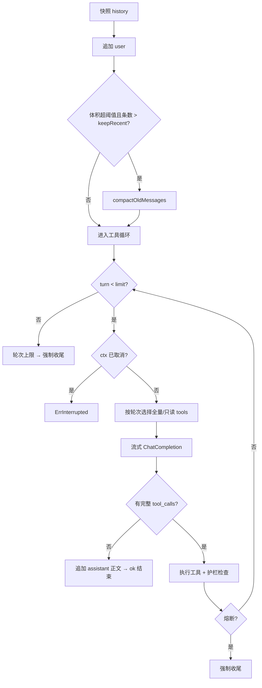

# chat — 功能逻辑

## 1. 职责

持有对话 `history`（即 OpenAI Chat Completions 的 `messages`，**零转换**），提供：

- 流式多轮回复与工具调用循环  
- 历史压缩（自动 / 手动）  
- 循环护栏（轮次、重复熔断、字符预算、工具集收缩）  
- 强制收尾、用户中断、`/status` 统计  

## 2. 代码位置

| 文件 | 说明 |
|------|------|
| `chat.go` | `Chat`、`StreamReply`、强制收尾、`Status`、`Reset`、中断判定 |
| `compact.go` | 历史体积、切分对齐、摘要请求、`Compact` |
| `dup.go` | 滑动窗口重复工具检测 |
| `loop_config.go` | 护栏环境变量与收尾 system 文案 |

## 3. 公开接口

```go
func New(baseURL, apiKey, model string) *Chat
func (c *Chat) StreamReply(ctx context.Context, userInput string, onDelta func(string)) error
func (c *Chat) Compact(ctx context.Context) string
func (c *Chat) Status() string
func (c *Chat) History() []openai.ChatCompletionMessage
func (c *Chat) SetHistory(msgs []openai.ChatCompletionMessage)
func (c *Chat) Reset()
var ErrInterrupted error // ctx 取消时返回；已完成的 history 保留
```

`onDelta`：模型正文片段，或进度行（以 `\n[` 开头，由 REPL 染黄）。  
`History` / `SetHistory`：深拷贝 messages（含 `ToolCalls`），供 `session` 切换与落盘；`SetHistory` 清空上一轮护栏统计。

## 4. 内部状态

| 字段 | 含义 |
|------|------|
| `client` / `model` | go-openai 客户端与模型名 |
| `history` | `[]ChatCompletionMessage` |
| `lastTurns` | 上一轮实际走过的工具循环次数 |
| `lastTools` | 上一轮真正 `Exec` 的次数（跳过的不算） |
| `lastChars` | 上一轮模型正文 + 工具返回的 Unicode 字符累计 |
| `lastReason` | 结束原因码：`ok` / `max_turns` / `dup` / `budget` / `interrupt` / 空 |
| `lastShrunk` | 上一轮是否触发过工具集收缩 |

`New`：`BaseURL` 去尾 `/` 后写入 SDK config。

---

## 5. 护栏配置（环境变量）

| 变量 | 默认 | 解析规则 |
|------|------|----------|
| `GEEKAGENT_MAX_HISTORY` | `4000` | 历史 JSON 字节长度阈值；`≤0` 或非法 → 默认 |
| `GEEKAGENT_MAX_TOOL_TURNS` | `8` | 工具循环上限；`<1` → 默认 |
| `GEEKAGENT_MAX_DUP_TOOLS` | `3` | 窗口内同参出现次数 ≥ 此值则熔断 |
| `GEEKAGENT_DUP_WINDOW` | `12` | 滑动窗口长度；若 `< 熔断次数` 则抬高到熔断次数 |
| `GEEKAGENT_MAX_REPLY_CHARS` | `120000` | 单次 `StreamReply` 字符预算；**`0` = 关闭** |
| `GEEKAGENT_SHRINK_TOOLS_AFTER` | `max(1, turns×3/4)` | 从该 **0-based** 轮次起只暴露只读工具；**显式 `0` = 关闭** |

未设置 `SHRINK_TOOLS_AFTER` 且默认轮次 8 → 从第 **7** 轮（index 6）起收缩。

字符计数：`utf8.RuneCountInString`（模型本轮 `content` + 每次工具返回正文）。

---

## 6. 主流程：`StreamReply`

### 6.1 总览



### 6.2 入队与快照

1. `snapshot := copy(history)` —— 供**非中断** API 错误时整段回滚。  
2. 追加 `role=user`，内容为 `userInput`。  
3. 清零上一轮统计字段。

### 6.3 自动压缩（可选）

条件：`historySize() > maxHistoryChars()` **且** `len(history) > keepRecent`。

| 结果 | `onDelta` 进度 |
|------|----------------|
| 合并 N 条 | `\n[历史压缩：N 条旧消息合并为 1 条摘要]\n` |
| 模型空摘要 | `\n[历史压缩：模型未产出摘要，保留原历史]\n` |
| 调用失败（非中断） | `\n[历史压缩失败：保留原历史]\n`（history 不变） |
| ctx 取消 | 返回 `ErrInterrupted` |

压缩细节见 §8。压缩**失败不阻断**后续对话。

### 6.4 工具循环（单轮）

对 `turn = 0 .. limit-1`：

1. **取消检查**：`ctx.Err() != nil` → `ErrInterrupted`（保留已写入 history）。  
2. **工具集**：  
   - 若 `shrinkAt > 0 && turn >= shrinkAt` → `tools.ToOpenAIAllow(ReadonlyNames())`；首次收缩时进度：`\n[工具集收缩：第 k 轮起仅保留只读工具 …]\n`  
   - 否则 → `tools.ToOpenAI()`  
3. **流式请求**：`Messages=history`，`Tools=…`，`Stream=true`。  
   - 创建失败且中断 → `ErrInterrupted`  
   - 创建失败其它 → **回滚到 snapshot**，返回 error  
4. **收流**：聚拢 `delta.Content` → `onDelta` + 本地 `answer`；按 `ToolCall.Index` 合并到 `pendingCall{id,name,args}`。  
5. **收流错误**：  
   - 中断：若已有正文且 tool_calls **未**全部具名 → 把半截正文入库为 assistant；返回 `ErrInterrupted`（**不**回滚）  
   - 其它：回滚 snapshot  
6. 正常结束后：`lastTurns = turn+1`；把本轮 `answer` 字符计入 `replyChars`。  
7. **分支 A — 存在且全部具名的 tool_calls**：见 §6.5。  
8. **分支 B — 无完整工具调用**：追加 `role=assistant`（纯文本），`lastReason=ok`，返回 `nil`。

循环自然耗尽：`lastReason=max_turns`，进度提示后进入强制收尾。

### 6.5 工具执行与护栏

1. 按 index 排序；缺 `id` 补 `call_{i}`。  
2. 先追加一条带 `ToolCalls` 的 assistant（可含同时输出的 content）。  
3. 对每个 tool call 顺序处理：  

| 条件 | 行为 |
|------|------|
| 本批已设 `stopReason` | 不 Exec；tool 回传「已因护栏熔断而跳过本次调用。」（保证配对） |
| `dupTracker.add(key)` 为真 | 不 Exec；回传重复警告；`stopReason=dup`；进度 `\n[重复工具：…]\n` |
| 正常 | `result = tools.Exec(name, args)`；`lastTools++`；进度 `\n[调用工具 name → result]\n`；追加 `role=tool`；累计 `replyChars` |
| 累计 ≥ 预算且预算>0 | 进度 `\n[回复预算：…]\n`；`stopReason=budget` |

4. 若 `stopReason != ""`：写入 `lastReason`；dup 时再提示「重复工具熔断…」；调用 `streamFinalAnswer`。  
5. 否则 `continue` 下一 `turn`。

**重复键**：`name + "\x00" + TrimSpace(args)`。窗口内计数（可非连续），见 `dup.go`。

### 6.6 强制收尾：`streamFinalAnswer`

目的：禁止再调工具，基于已有结果给出用户可读结论。

1. 请求 messages = **history 副本 + 一条临时 system**（`wrapUpSystem`）。  
   - 临时 system **不写入**持久 `c.history`。  
2. `ToolChoice: "none"`，流式。  
3. **创建失败（非中断）**：追加固定友好文案为 assistant，返回 `nil`（会话可继续）。  
4. **流中中断**：若有半截正文则入库，返回 `ErrInterrupted`。  
5. **其它流错误**：回滚到 **最初 snapshot**（含本轮 user 之前）。  
6. 正文 trim 为空：替换为停止提示并 `onDelta`。  
7. 最终 assistant 写入 `c.history`。

收尾 system 要求模型用中文说明：已完成 / 未完成 / 建议下一步；禁止再提议调工具。

---

## 7. 回滚与中断策略

| 情形 | history 处理 |
|------|----------------|
| 用户中断（ctx 取消 / Canceled） | **保留**已写入的 user、完整工具对、可选半截正文 |
| 主循环 / 收尾流的非中断错误 | **整段回滚**到入队 user 前的 snapshot |
| 收尾「创建请求」失败 | **不**回滚；追加 fallback assistant |
| 压缩失败 | 保留压缩前 history |

导出错误：`errors.Is(err, chat.ErrInterrupted)`。

---

## 8. 历史压缩

### 8.1 体积度量

`historySize()` = `len(json.Marshal(history))`（字节，非 rune）。Marshal 失败视为 0。

### 8.2 切分（防 orphan tool）

```
split = len(history) - keepRecent   // keepRecent = 6
while split > 0 && history[split].Role == "tool":
    split--   // 不能让 recent 以孤立 tool 开头
if split <= 0: 不压缩
```

旧段 `history[:split]` → 非流式请求模型摘要；recent 原样保留。

### 8.3 摘要请求

- system：`compressSystem`（压缩器人设）  
- user：旧消息的缩进 JSON  
- 成功：history 变为  
  `[ system「【此前对话摘要】\n…」 ] + recent`  
- 空 choices / 空 content：返回 dropped=0，**不改** history  

### 8.4 手动 `Compact`

| 条件 | 返回文案 |
|------|----------|
| `len ≤ keepRecent` | `历史压缩：没有可压缩的旧消息` |
| 错误 | `历史压缩失败：保留原历史` |
| dropped>0 | `历史压缩：N 条旧消息合并为 1 条摘要` |
| dropped==0 | `历史压缩：模型未产出摘要，保留原历史` |

**不做**：二次摘要保护、工具循环中途压缩（仅在 user 入队后、循环前自动触发）。

---

## 9. 重复检测：`dupTracker`

- 维护队列 `keys` 与计数 `counts`。  
- `add(key)`：入队；超出 `window` 则弹出队首并减计数；若当前 key 计数 ≥ `limit` 返回 true（熔断）。  
- 覆盖「连续同参」与「窗口内非连续同参」两种空转。

---

## 10. `Status` / `History` / `Reset`

`Status()` 拼中文多行：模型、消息条数、历史字符/阈值、轮次上限、重复熔断、预算、收缩策略、上一轮工具轮次/执行次数/字符/是否曾收缩/结束原因（映射为中文）。

`History()` / `SetHistory(...)`：深拷贝读写 history；切换会话时由 `session.Manager` 调用。

`Reset()`：清空 `history` 与全部 `last*`。

---

## 11. 依赖与边界

| 方向 | 对象 |
|------|------|
| 依赖 | `internal/tools`（`ToOpenAI` / `ToOpenAIAllow` / `ReadonlyNames` / `Exec`）、`go-openai` |
| 调用方 | `cmd/hi-agent`、`internal/session` |

边界：会话 Map/落盘在 `session` 模块；无权限 deny 联动（Day8）；无真实 USD 计费（预算用字符代理）。
