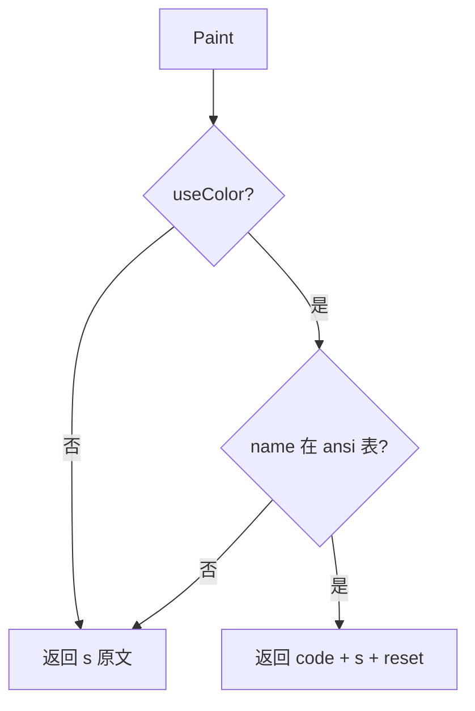

# color — 功能逻辑

## 1. 职责

为 REPL 提供统一的 ANSI 终端着色：按角色（用户 / 模型 / 工具 / 系统）上色，并在非 TTY 下自动退化为纯文本。

## 2. 代码位置

| 文件 | 说明 |
|------|------|
| `internal/color/color.go` | 颜色常量、`Paint` / `Out` / `Err` |

## 3. 颜色约定

| 常量 | 键名 | ANSI | 观感 | 典型用途 |
|------|------|------|------|----------|
| `User` | `user` | `\x1b[36m` | 青 | 提示符 `You ›` |
| `Model` | `model` | `\x1b[32m` | 绿 | 模型流式正文 |
| `Tool` | `tool` | `\x1b[33m` | 黄 | 工具进度、确认、中断提示 |
| `Sys` | `sys` | `\x1b[90m` | 灰 | Banner、帮助、状态、错误前缀 |

复位码：`\x1b[0m`（`Paint` 在着色时追加）。

## 4. 初始化：是否启用颜色

包加载时执行一次：

```go
useColor = term.IsTerminal(int(os.Stdout.Fd()))
```

| 场景 | `useColor` |
|------|------------|
| 交互终端 | `true` |
| 管道 / 重定向 stdout | `false` → `Paint` 原样返回 |

**注意**：只在 init 时检测 **stdout**；运行中切换重定向不会更新。stderr 着色与否跟随同一开关。

## 5. 接口与逻辑

### 5.1 `Paint(name, s string) string`



- 未知 `name`：**静默**退回原文，不报错。  
- 不修改 `s` 内部换行；调用方负责分段。

### 5.2 `Out(name, s string, nl bool)`

1. `text := Paint(name, s)`  
2. `nl == true` → `fmt.Fprintln(os.Stdout, text)`  
3. 否则 → `fmt.Fprint(os.Stdout, text)`（流式片段常用）

### 5.3 `Err(name, s string)`

- 始终写 **stderr** 并换行：`Fprintln(os.Stderr, Paint(...))`。  
- REPL 用于「请求失败」等错误行。

## 6. 与 REPL 的协作约定

REPL 不直接拼 ANSI，只传颜色键：

- 模型正文 → `Model`  
- 以 `\n[调用工具` 等前缀开头的进度行 → `Tool`  
- Banner / 命令反馈 → `Sys`  
- 提示符用 `Paint(User, "You › ")` 后 `Fprint`

本模块**不解析**进度行前缀；前缀分类在 `cmd/hi-agent`。

## 7. 边界与非目标

- 不做 Markdown 渲染、终端宽度折行、主题切换。  
- 无 Windows 专用 VT 启用逻辑（依赖运行环境已支持 ANSI）。  
- 不依赖其它业务模块。

## 8. 依赖与调用方

| 方向 | 对象 |
|------|------|
| 外部依赖 | `golang.org/x/term` |
| 内部依赖 | 无 |
| 调用方 | `cmd/hi-agent` |
