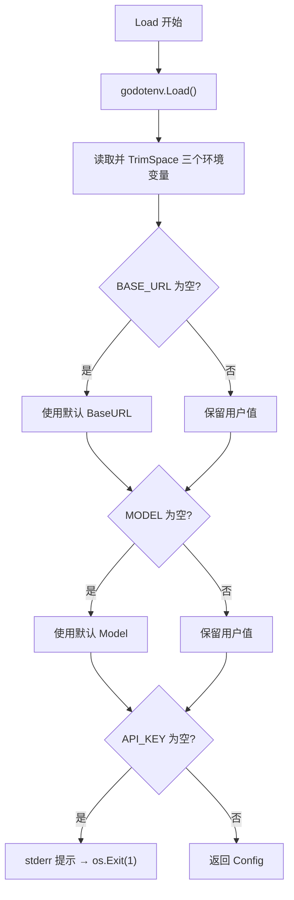

# config — 功能逻辑

## 1. 职责

从环境变量（及可选 `.env`）读取 OpenAI 兼容接口配置，供 REPL 创建 `chat.Chat`。  
本模块**不做**网络探测、密钥校验以外的启动逻辑。

## 2. 代码位置

| 文件 | 说明 |
|------|------|
| `internal/config/config.go` | `Config` 结构体与 `Load` |

## 3. 数据结构

```go
type Config struct {
    BaseURL string // API 根路径，无强制尾斜杠处理（由 chat.New 再 TrimRight）
    APIKey  string // Bearer / SDK 使用的密钥
    Model   string // Chat Completions 的 model 字段
}
```

## 4. 环境变量

| 变量 | 是否必填 | 默认值 | 说明 |
|------|----------|--------|------|
| `OPENAI_API_KEY` | **是** | — | 为空（含仅空白）则进程退出 |
| `OPENAI_BASE_URL` | 否 | `https://api.deepseek.com` | 兼容任意 OpenAI 风格网关 |
| `OPENAI_MODEL` | 否 | `deepseek-v4-flash` | 模型名原样传给上游 |

与工具循环相关的 `GEEKAGENT_*` **不属于**本模块，见 chat 文档。

## 5. 逻辑流程：`Load`



### 逐步说明

1. **加载 `.env`**  
   - 调用 `godotenv.Load()`，忽略「文件不存在」等错误。  
   - **已在进程环境中导出的变量优先**，不会被 `.env` 覆盖（godotenv 默认行为）。

2. **读取字段**  
   - 一律 `strings.TrimSpace`；空白等价于未设置。

3. **填默认值**  
   - 仅 `BaseURL`、`Model` 有默认；`APIKey` 无默认。

4. **校验失败**  
   - 向 **stderr** 打印：`缺少 OPENAI_API_KEY：请复制 .env.example 为 .env 并填写。`  
   - 调用 `os.Exit(1)`，**不返回** error（调用方无需处理）。

5. **成功**  
   - 返回填充好的 `Config` 值拷贝。无缓存；每次 `Load()` 重新读环境。

## 6. 边界与非目标

- 不验证 URL 格式、可达性、密钥是否有效。  
- 不解析其它配置文件（如 Day8 的 `.geekagent/GeekAgent.json`）。  
- 不把密钥写入日志或文档示例以外的地方。

## 7. 依赖与调用方

| 方向 | 对象 |
|------|------|
| 外部依赖 | `github.com/joho/godotenv` |
| 内部依赖 | 无 |
| 调用方 | `cmd/hi-agent`（启动时一次） |
