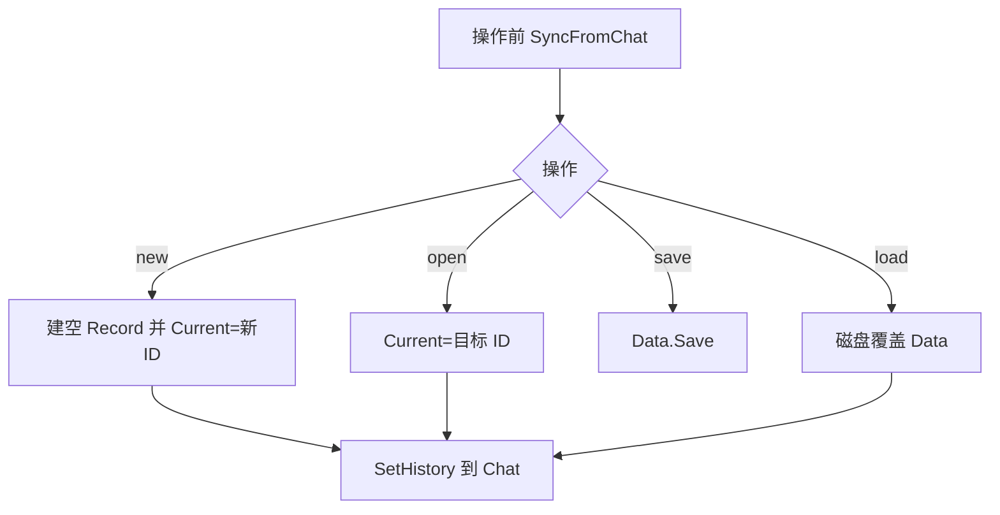

# session — 功能逻辑

## 1. 职责

多会话内存管理与落盘：维护 `current` + `sessions` Map，与单个 `chat.Chat` 的 history 双向同步；文件路径 `.geekagent/sessions.json`（不入库）。

## 2. 代码位置

| 文件 | 说明 |
|------|------|
| `internal/session/store.go` | `Data` / `Record`、Load/Save、Rename、NewID |
| `internal/session/manager.go` | 与 `chat.Chat` 绑定的切换/新建/列表/退出 |

## 3. 落盘格式

```json
{
  "current": "default",
  "sessions": {
    "default": {
      "id": "default",
      "updatedAt": "...",
      "messages": [ /* OpenAI ChatCompletionMessage */ ]
    }
  }
}
```

`messages` 即 history，零转换。

## 4. Manager 流程



| 方法 | 行为 |
|------|------|
| `SyncFromChat` | `PutMessages(current, chat.History())` |
| `NewSession(id)` | 同步 → 建空会话（id 空则 8 位 hex）→ 切换 → Chat 清空 |
| `Open(id)` | 同步 → 切换 → `SetHistory` 目标消息 |
| `ListLines` | 同步后列出 `* id (N 条消息)` |
| `Save` | 同步 + 写盘 |
| `Load` | 读盘替换内存（未保存改动丢失）→ 应用到 Chat |
| `PrepareExit` | 同步；若 `current==default` 且有消息 → Rename 为 8 位 ID；Save |

## 5. 边界

- 一个进程一个 Chat；切换靠替换 history，不并行多 Client。  
- ID：非空、无空白与路径分隔符。  
- 不实现云同步、标题、加密。  
- `.geekagent/` 已在 `.gitignore`。

## 6. 依赖

| 方向 | 对象 |
|------|------|
| 依赖 | `internal/chat`（History/SetHistory）、`go-openai` 消息类型 |
| 调用方 | `cmd/hi-agent` |
