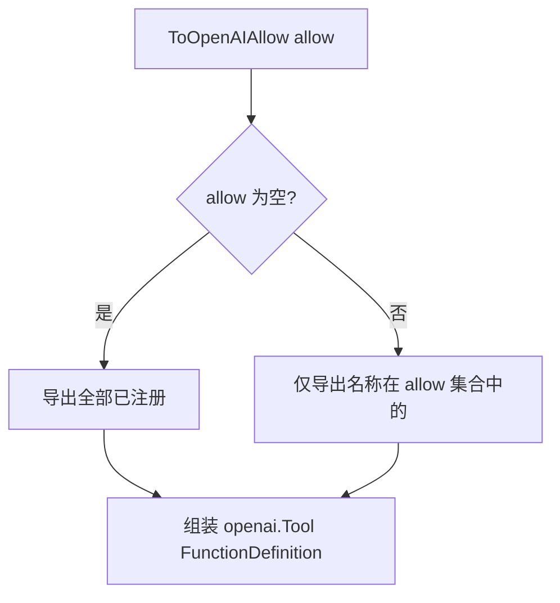
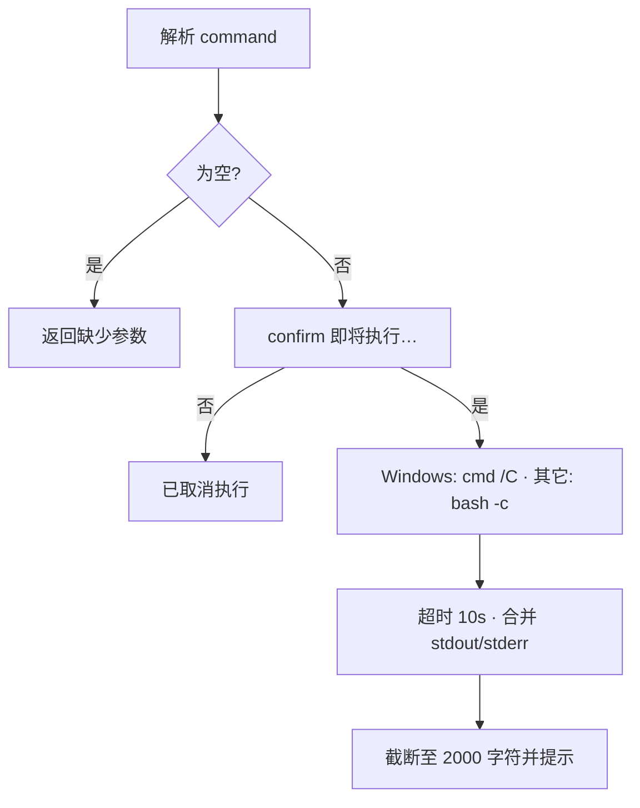
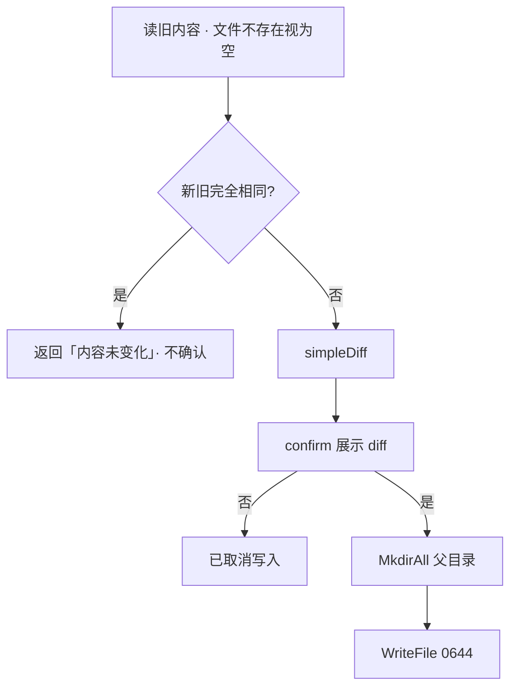

# tools — 功能逻辑

## 1. 职责

维护进程内工具注册表：声明说明书（供模型选工具）、按名执行、转为 OpenAI `tools` 参数；可选注入「危险操作确认」。  
chat 模块只通过本包的注册表 API 与模型交互，**禁止**在循环里硬编码工具列表。

## 2. 代码位置

| 文件 | 内容 |
|------|------|
| `tools.go` | `Tool`、`Register`、`ToOpenAI` / `ToOpenAIAllow`、`Exec`、`Names`、`ReadonlyNames`、`init` |
| `confirm.go` | `ConfirmFn`、`SetConfirm`（默认拒绝） |
| `time.go` | `get_current_time` |
| `shell.go` | `run_shell` |
| `files.go` | `ls` / `glob` / `read` / `write` / `patch` 与 diff 落盘 |

## 3. 核心抽象

```go
type Tool struct {
    Name        string
    Description string
    Parameters  any                    // JSON Schema 风格 map，交给 SDK
    Run         func(argsJSON string) (string, error)
}
```

- 新增工具必须 `Register`；重名或空名 → **panic**（启动期失败，避免静默丢工具）。  
- `init` 注册顺序：`get_current_time` → `run_shell` → `ls` → `glob` → `read` → `write` → `patch`。

## 4. 注册表 API 流程

### 4.1 `Register`

加锁 → 查重 → 追加 `registry`。

### 4.2 `ToOpenAI` / `ToOpenAIAllow`



`ToOpenAI()` ≡ `ToOpenAIAllow(nil)`。

### 4.3 `ReadonlyNames`

只读集合（写死）：`get_current_time`、`ls`、`glob`、`read`。  
返回 **已注册 ∩ 只读集合**（顺序随 registry）。  
chat 收缩工具集时用：`ToOpenAIAllow(ReadonlyNames())`。

未列入只读：`run_shell`、`write`、`patch`（收缩后模型看不到，一般无法再调）。

### 4.4 `Exec(name, argsJSON) string`

面向模型的**字符串结果**（错误也写成文本，不抛给循环）：

| 情况 | 返回示例 |
|------|----------|
| 未知工具 | `未知工具：xxx` |
| `argsJSON == ""` | 按 `"{}"` 继续 |
| 非法 JSON | `参数不是合法 JSON：…` |
| `Run` 返回 err | `工具执行失败：…` |
| 成功 | `Run` 的 string |

并发：读注册表用 `RLock`；执行在锁外，避免慢工具堵注册。

---

## 5. 确认机制

```go
type ConfirmFn func(prompt string) bool
func SetConfirm(fn ConfirmFn)  // fn==nil → 永久拒绝
```

| 默认 | 含义 |
|------|------|
| 未注入时 `confirm` 恒为 `false` | 取消执行（安全默认） |

REPL 启动时注入：读一行，`y` / `yes`（忽略大小写）为真。  
需要确认的工具：`run_shell`、`write`、`patch`（经 `commitWrite`）。

---

## 6. 各工具逻辑

### 6.1 `get_current_time`

- 参数：无（空对象即可）。  
- 时区：`Asia/Shanghai`；Load 失败则用 `FixedZone("CST", +8h)`。  
- 格式：`2006/1/2 15:04:05`。  
- **免确认**。

### 6.2 `run_shell`



| 常量 | 值 |
|------|-----|
| 超时 | 10s |
| 输出上限 | 2000 字符（rune） |

超时/非零退出：仍把说明文本返回给模型（`Run` 层常返回 nil error + 说明串，或由 truncate 包装），保证循环可继续。

### 6.3 `ls`

- 参数：`path` 可选，默认 `.`。  
- 输出每行：`dir|file` + 名称。  
- 免确认。路径错误 → `Run` error → `Exec` 包装。

### 6.4 `glob`

- 参数：`pattern` 必填。  
- 从 `.` 起 Walk；**跳过名为 `.git` 的目录**。  
- 匹配：按路径段；`*` 用 `filepath.Match`；`**` 表示跨目录递归。  
- 最多 **200** 条；超出附加截断提示。  
- 无匹配：返回说明文案。免确认。

### 6.5 `read`

- 参数：`path` 必填；`offset` 可选（字符偏移，`<0` 当作 0）。  
- 单次最多约 **8000** 字符；若还有后续，提示下次 `offset`。  
- 免确认。

### 6.6 `write` / `patch` → `commitWrite`

**write**：`path` + `content` → 直接进入 `commitWrite`。

**patch**：

1. 读出原文件（不存在则失败）。  
2. 对每个 hunk：`old` 在全文中必须 **恰好出现 1 次**；否则失败并说明。  
3. 按顺序 `strings.Replace(..., old, new, 1)`。  
4. 得到新全文后进入 `commitWrite`。

**commitWrite 流程**：



**simpleDiff**：

- 按行比较，去掉公共最长前缀行与后缀行。  
- 输出 `-` 旧 / `+` 新风格文本。  
- 最多 **100** 行差异展示，超出截断提示。

---

## 7. 与 chat 的协作

| chat 行为 | tools API |
|-----------|-----------|
| 正常轮 | `ToOpenAI()` |
| 收缩轮 | `ToOpenAIAllow(ReadonlyNames())` |
| 执行 | `Exec(name, args)` —— 结果整段进 `role=tool` 与进度行 |
| REPL 启动 | `SetConfirm(...)` |

工具内部**不感知**轮次上限、重复熔断、预算；那些在 chat。

## 8. 边界与非目标

- 无目录沙箱 / allow-deny（Day8）。  
- 无 `/undo` 撤销栈（Day8）。  
- `patch` 不做模糊匹配；锚点必须唯一。  
- Windows 下 `run_shell` 经 `cmd /C`，输出编码可能与控制台代码页有关（已知乱码风险，未在本阶段修）。

## 9. 依赖与调用方

| 方向 | 对象 |
|------|------|
| 外部 | `go-openai`（仅类型）、标准库 |
| 内部 | 无 |
| 调用方 | `internal/chat`、`cmd/hi-agent` |
